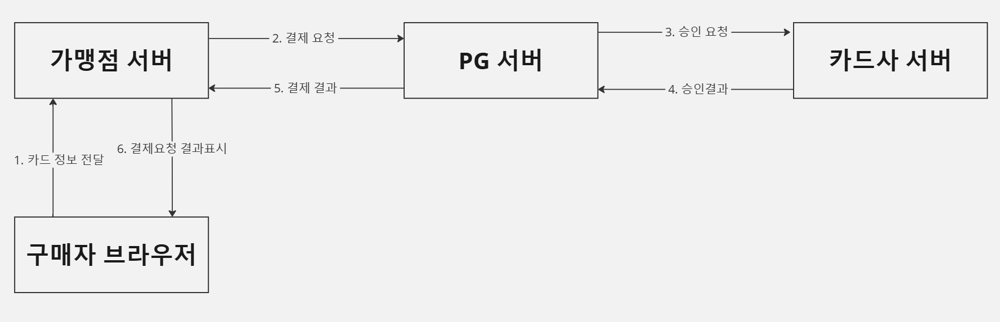
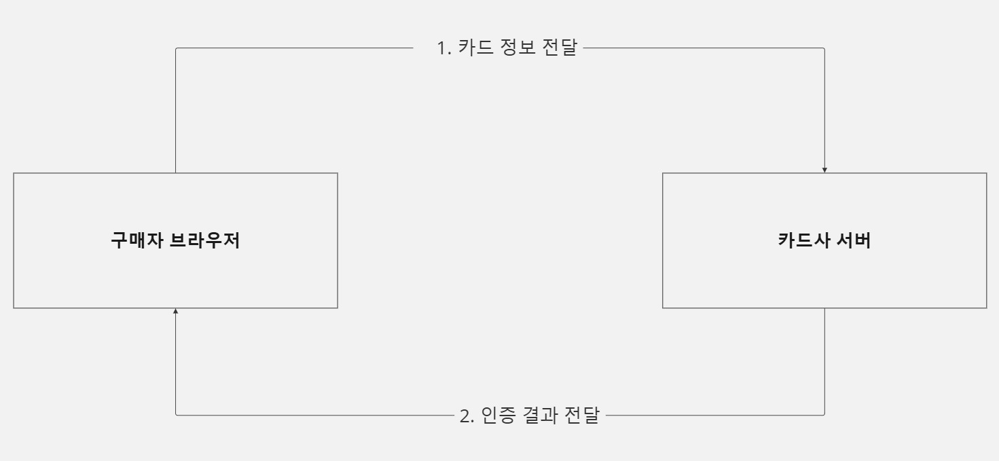
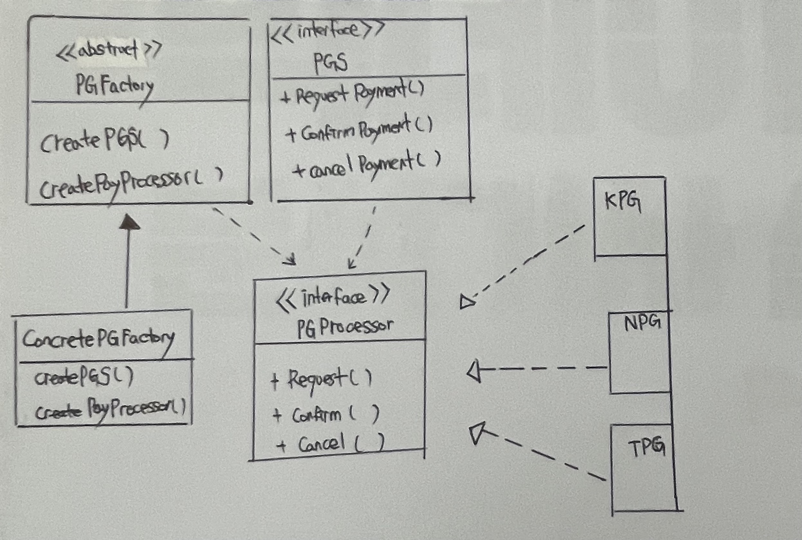

## 온라인 결제 흐름
    온라인 결제 흐름은 다음과 같은 순서로 진행된다.
### 결제
-----------

  2. 구매자 정보, 연락처 주문번호  
  3. 인증키 + 승인요청 
  
### 인증
---------

  카드사 서버가 구매자로부터 직접 카드정보를 전달받아 인증처리
  
  - 가맹점 / PG서버 : 카드사로부터 전달되는 인증결과 정보만 획득
    - 인증 X : 카드 정보/ 유효기간/ 비밀번호
    - 인증 O 결제 X : 한도초과/ 분실카드

### PG란 무엇인가? 
----
    PG(Payement GateWay) 온라인 결제의 핵심으로 카드사, 은행, 통신사, 상품권 판매사 등 금융기관과 온라인 쇼핑몰 사이에서 결제를 대행하는 관문.

  - 인증

        온라인 결제의 경우에는 오프라인과 다르게 별도의 인증 장치가 필요하다.
        PG사는 카드번호, 유효기간, CVC, 비밀번호 두 자리 등으로 별도 인증 절차를 수행한다.
  - 승인

        고객에게 받은 정보를 카드사에게 전달한다. 카드사는 곧 카드의 사용 가능 여부를 확인 후 승인 결과를 보낸다.
        이 결과를 다시 VAN사를 통해 판매자, 고객에게 전달하는 역할까지 PG가 맡아 진행한다.
  - 정산

        결제 승인까지 이루어졌다면 VAN사를 걸쳐 매출 전표가 카드사에 전달된다.
        그럼 카드사는 결제 대금을 PG사에 지급한다. 이때 PG사는 모든 카드사로부터 지급받은 돈에서 수수료를 제외하고 가맹주에게 정산한다.
### 비즈니스 요구사항 
1. 다수의 PG 결제 서비스 하나로 PG Apis로 통합 서비스
     - 최초 요구사항은 연동 가능한 PG사는 1개 이지만, 향후 추가될 가능성이 있다.
     - 연동할 PG사 브랜드는 자유이다.(Toss Payment 선택예정)
     - 설계 시 확장 가능성을 고려 해야 한다.

2. 다수의 PG 서비스 하나의 PG APIS 공통화-> (RequestDto / ResponseDto)
    - PG사 마다 요청 메시지와 응답 메시지의 형식은 다르다.   
### 과제 내용
요구사항을 만족하는 설계 도면을 그려 주세요.
- 

#### 출처
[기획자가 알아야할 결제시스템 구조](https://yozm.wishket.com/magazine/detail/2585/)

  
  
